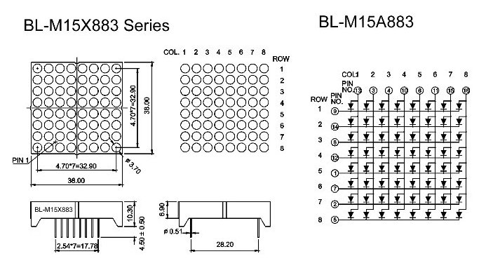

#### basiic code:

#### URL1:http://justanotherelectronicsblog.com/?p=201

#### URL2: https://github.com/riktw/DriveLedsWithDMA

``` cpp


Projects have been generated using stm32cubemx ,no use any IDE.
assembly of the project with the utility of make

All code is LGPL licensed unless stated otherwise in the file.

seting circular mode manual in file dma.c:
after generation of a code, establish - DMA_CIRCULAR;

hdma_memtomem_dma1_channel1.Init.Mode = DMA_CIRCULAR;
hdma_memtomem_dma1_channel2.Init.Mode = DMA_CIRCULAR;
```
